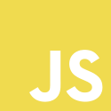
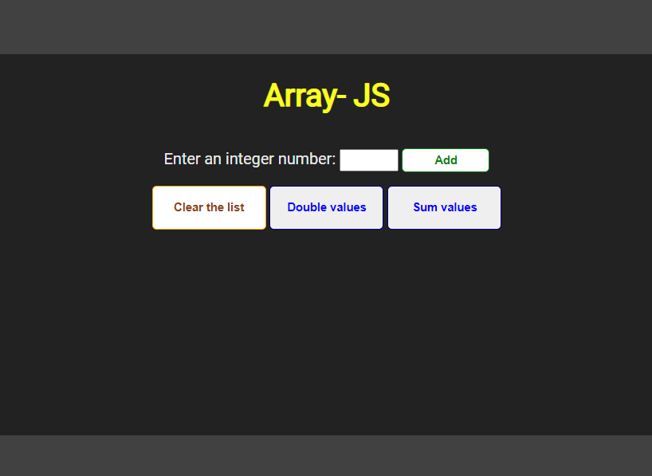

# Array-JS

[Português](#português) &nbsp; | &nbsp; [English](#english) 

<table>
  <tr>
    <th>HTML</th>
    <th>CSS</th>
    <th>JavaScript</th>
  </tr>
  <tr align="center">
    <td>
      
    </td>
    <td>
      
    </td>
    <td >
      
    </td>
  </tr>
</table>

| Status do Projeto  | Project Status | License |
|        :---:       |      :---:     |  :---:  |
| Em desenvolvimento |   In Progress  |   MIT   |

|                       [Kyara Araújo](https://github.com/kyaraaraujo)                              |
|                                        :---:                                                      |
|  |  
  
 

---

## Português

## Tópicos

[Objetivo](#objetivo) &nbsp;&nbsp; | &nbsp;&nbsp; 
[Aprendizados](#aprendizados) &nbsp;&nbsp; | &nbsp;&nbsp; 
[Preocupações de qualidade](#preocupações-de-qualidade) &nbsp;&nbsp; | &nbsp;&nbsp; 
[Como usar](#como-usar) &nbsp;&nbsp; | &nbsp;&nbsp; 
[Referências](#referências) &nbsp;&nbsp; 

 

## Objetivo:
O objetivo deste projeto é praticar a manipulação de array de números e utilizar como consulta de estudo.
O usuário pode adicionar números à uma lista, dobrar o valor de cada número dela, somar todos os valores e limpar a lista.

## Aprendizados
 - Objeto document: é necessário ter cuidado ao criar funções, variáveis, etc de escopo global.
 - Refatoração
 - Manipulação:
    - do input, seu valor e comportamento (autofocus, tipo e limite de carateres).
    - criação e utilização de módulos
    - Array: alterações usando os métodos push(), map() e reduce()
    - Elementos HTML com JavaScript: busca/criação/remoção de elementos/conteúdo, método focus()
- Evento do click do botão de tipo submit:
    - Função necessita receber parâmetro (event)
    - Prevenir comportamento default do submit: event.preventDefault()

## Preocupações de Qualidade
- Programação declarativa
- Alguns pontos do clean code.
- Input: limite de caracteres, tipo, autofocus ao carregar a página, focus e limpeza após clicar no botão Add. 
- Mensagens: de resultados e "erros"
- Comportamento dos elementos em tela redimensionada
- Acessibilidade

## **Como Usar**

Através de servidor local (exemplo: criando seu servidor ou alguma extensão do VS Code como: Live Server de Ritwick Dey).

## Referências
- [Sobre licenças](http://escolhaumalicenca.com.br/licencas/)
- [Markdown Cheat Sheet](https://www.markdownguide.org/cheat-sheet/)
- [Inspiração de template para README](https://github.com/devgirlsbr/templates/tree/main/readme-101)  realizado por [Clarissa Leal](https://github.com/lealclarissa) e [Eline Pimentel](https://github.com/eline-create)

---
⬆ [Voltar ao início](#array-js)

  

## English

## Topics

[Purpose](#purpose) &nbsp;&nbsp; | &nbsp;&nbsp; 
[Learnings](#learnings) &nbsp;&nbsp; | &nbsp;&nbsp; 
[Quality Concerns](#quality-concerns) &nbsp;&nbsp; | &nbsp;&nbsp; 
[How to Use](#how-to-use) &nbsp;&nbsp; | &nbsp;&nbsp; 
[References](#references) &nbsp;&nbsp; 

 

## Purpose
The intention of this project is for practicing array manipulation and for study purpose.
The user can add number to a list, double each value, sum all values and clean the list.

## Learnings
- Document Object: must be careful creating global functions, variables, etc.
 - Refactoring
 - Handling:
    - input: its value and behavior (autofocus, type and max characters allowed)
    - creating and using modules
    - Array:  using push(), map() and reduce() methods
    - HTML elements with JavaScript: search/create/remove elements/content, focus() method
 - Submit button click event:
    - Function needs a parameter (event)
    - To prevent default submit behavior: event.preventDefault()

## Quality Concerns
- Declarative programming
- Some clean code points.
- input char limit and type
- Messages: results and "failures"
- Elements behavior when the browser's window is resized.
- Accessibility.

## **How to Use**

By running a local server (example: creating your server or using some VS Code extension like: Live Server by Ritwick Dey).

## References

- [About Licenses](https://choosealicense.com/);  
- [Markdown Cheat Sheet](https://www.markdownguide.org/cheat-sheet/);  
- [Template inspiration for README file](https://github.com/devgirlsbr/templates/tree/main/readme-101) by [Clarissa Leal](https://github.com/lealclarissa) and [Eline Pimentel](https://github.com/eline-create)

---
⬆ [Back to the top](#array-js)
